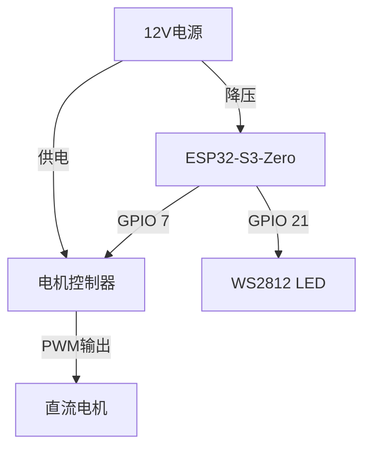
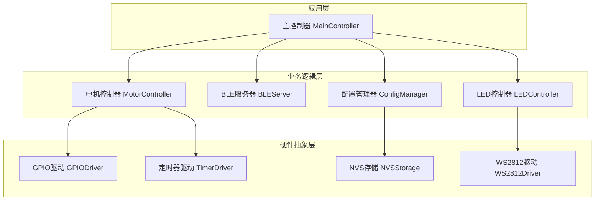

# ESP32-S3-Zero 电机定时控制系统

[](https://opensource.org/licenses/MIT)
[](https://registry.platformio.org/platforms/platformio/espressif32)

基于ESP32-S3-Zero开发板的大电流PWM电机调速控制系统，通过BLE无线技术实现电机的智能定时循环控制。

## 🎯 项目概述

本项目是一个专业的电机定时控制系统，专为ESP32-S3-Zero开发板设计。系统通过蓝牙低功耗(BLE)技术实现无线控制，支持精确的运行时长和停止间隔设置，适用于各种需要定时循环控制的电机应用场景。

### 核心特性
- **无线控制**: 通过BLE实现手机APP无线控制
- **定时循环**: 支持1-999秒的精确运行时长和停止间隔设置
- **状态可视化**: 通过RGB LED实时显示系统状态
- **参数持久化**: 配置参数自动保存到NVS存储
- **即插即用**: 开机自动运行，无需额外配置

## 🚀 功能特性

### 电机控制
- **精确控制**: 支持1-999秒的运行时长设置
- **灵活间隔**: 支持0-999秒的停止间隔设置（0秒为持续运行）
- **循环模式**: 自动循环运行，无需人工干预
- **手动控制**: 支持随时启动/停止电机

### BLE通信
- **设备名称**: `ESP32-Motor-Control`
- **服务UUID**: `beb5483e-36e1-4688-b7f5-ea07361b26a8`
- **实时状态**: 支持实时状态推送和查询
- **参数配置**: 支持运行时参数动态调整

### 状态指示
| 状态 | LED颜色 | 模式 | 说明 |
|------|---------|------|------|
| 系统启动 | 白色 | 闪烁 | 初始化中 |
| BLE等待连接 | 蓝色 | 慢闪 | 等待手机连接 |
| BLE已连接 | 绿色 | 常亮 | 手机已连接 |
| 电机运行 | 青色 | 常亮 | 电机正在运行 |
| 电机停止 | 黄色 | 常亮 | 电机停止中 |
| 系统停止 | 红色 | 常亮 | 手动停止状态 |

## 🛠️ 硬件需求

### 必需硬件
- **主控制器**: ESP32-S3-Zero开发板
- **电机控制器**: SMG 30A电机调速器（或兼容的PWM控制器）
- **电源**: 12V直流电源（根据电机规格选择）
- **连接线**: 杜邦线若干

### GPIO分配
| GPIO引脚 | 功能 | 说明 |
|----------|------|------|
| GPIO 21 | WS2812 RGB LED | 板载状态指示 |
| GPIO 7 | 电机控制信号 | 控制电机启停 |

### 硬件连接图


## 📋 软件架构

### 系统架构


### 核心模块
| 模块 | 职责 | 状态 |
|------|------|------|
| [MainController](src/controllers/MainController.h) | 系统主控制器 | ✅ 已完成 |
| [MotorController](src/controllers/MotorController.h) | 电机控制逻辑 | ✅ 已完成 |
| [BLEServer](src/controllers/MotorBLEServer.h) | BLE通信服务 | ✅ 已完成 |
| [LEDController](src/controllers/LEDController.h) | LED状态指示 | ✅ 已完成 |
| [ConfigManager](src/controllers/ConfigManager.h) | 配置管理 | ✅ 已完成 |

## 🚀 快速开始

### 环境准备
1. **安装开发环境**
   ```bash
   # 安装PlatformIO Core
   pip install platformio
   
   # 或者安装PlatformIO IDE (VSCode插件)
   # 在VSCode扩展中搜索 "PlatformIO IDE"
   ```

2. **克隆项目**
   ```bash
   git clone https://github.com/davidhoo/esp32motor.git
   cd esp32motor
   ```

3. **安装依赖**
   ```bash
   pio lib install
   ```

### 编译和上传
1. **连接硬件**
   - 使用USB-C线连接ESP32-S3-Zero到电脑
   - 确保驱动程序已正确安装

2. **编译项目**
   ```bash
   pio run
   ```

3. **上传固件**
   ```bash
   pio run --target upload
   ```

4. **监控串口输出**
   ```bash
   pio device monitor
   ```

### 首次使用
1. **系统启动**
   - 上电后LED白色闪烁（初始化）
   - LED蓝色慢闪（等待BLE连接）
   - 自动开始电机循环控制

2. **手机连接**
   - 打开手机蓝牙
   - 使用BLE调试工具（如nRF Connect）
   - 连接设备 `ESP32-Motor-Control`

## 📱 BLE API文档

### 服务信息
- **服务UUID**: `beb5483e-36e1-4688-b7f5-ea07361b26a8`

### 特征值定义
| 特征 | UUID | 权限 | 数据格式 | 示例 |
|------|------|------|----------|------|
| 运行时长 | `2f7a9c2e-6b1a-4b5e-8b2a-c1c2c3c4c5c6` | 读/写/通知 | 字符串 | `"30"` |
| 停止间隔 | `3f8a9c2e-6b1a-4b5e-8b2a-c1c2c3c4c5c7` | 读/写/通知 | 字符串 | `"60"` |
| 系统控制 | `4f9a9c2e-6b1a-4b5e-8b2a-c1c2c3c4c5c8` | 读/写/通知 | 字符串 | `"1"` |
| 状态查询 | `5f9a9c2e-6b1a-4b5e-8b2a-c1c2c3c4c5c9` | 读/通知 | JSON | 见下方 |

### 状态JSON格式
```json
{
  "state": 1,
  "stateName": "RUNNING",
  "remainingRunTime": 25,
  "remainingStopTime": 0,
  "currentCycleCount": 3,
  "runDuration": 30,
  "stopDuration": 10,
  "cycleCount": 5,
  "autoStart": true,
  "uptime": 123456,
  "freeHeap": 234567
}
```

### 使用示例
```python
# Python示例代码
from bluepy.btle import Peripheral, UUID

# 连接设备
device = Peripheral("ESP32-Motor-Control")

# 获取服务
service = device.getServiceByUUID("beb5483e-36e1-4688-b7f5-ea07361b26a8")

# 设置运行时长为60秒
run_duration_char = service.getCharacteristics("2f7a9c2e-6b1a-4b5e-8b2a-c1c2c3c4c5c6")[0]
run_duration_char.write("60".encode())

# 启动电机
control_char = service.getCharacteristics("4f9a9c2e-6b1a-4b5e-8b2a-c1c2c3c4c5c8")[0]
control_char.write("1".encode())

# 读取状态
status_char = service.getCharacteristics("5f9a9c2e-6b1a-4b5e-8b2a-c1c2c3c4c5c9")[0]
status = status_char.read().decode()
print(status)
```

## 🔧 开发指南

### 项目结构
```
esp32motor/
├── src/
│   ├── main.cpp                 # 主程序入口
│   ├── controllers/             # 业务逻辑层
│   │   ├── MainController.h/.cpp    # 主控制器
│   │   ├── MotorController.h/.cpp   # 电机控制器
│   │   ├── MotorBLEServer.h/.cpp    # BLE服务器
│   │   ├── LEDController.h/.cpp     # LED控制器
│   │   └── ConfigManager.h/.cpp     # 配置管理器
│   ├── drivers/                 # 硬件抽象层
│   │   ├── GPIODriver.h/.cpp        # GPIO驱动
│   │   ├── TimerDriver.h/.cpp       # 定时器驱动
│   │   ├── NVSStorage.h/.cpp        # NVS存储驱动
│   │   └── WS2812Driver.h/.cpp      # WS2812驱动
│   ├── common/                  # 公共组件
│   │   ├── Config.h                 # 全局配置
│   │   ├── EventManager.h/.cpp      # 事件管理
│   │   ├── Logger.h/.cpp            # 日志系统
│   │   ├── PowerManager.h/.cpp      # 电源管理
│   │   └── StateManager.h/.cpp      # 状态管理
│   └── tests/                   # 单元测试
├── docs/                        # 项目文档
├── examples/                    # 使用示例
├── platformio.ini              # PlatformIO配置
└── README.md                   # 项目说明
```

### 开发环境
- **开发框架**: Arduino Core for ESP32
- **构建系统**: PlatformIO
- **编程语言**: C++17
- **代码风格**: Google C++ Style Guide

### 编译配置
项目支持两种编译环境：

#### 生产环境
```ini
[env:esp32-s3-zero]
platform = espressif32
board = esp32-s3-devkitc-1
framework = arduino
```

#### 测试环境
```ini
[env:test]
platform = espressif32
board = esp32-s3-devkitc-1
framework = arduino
build_flags = -DENABLE_TESTING=1
```

#### MODBUS测试环境
```ini
[env:modbus-test]
platform = espressif32
board = esp32-s3-devkitc-1
framework = arduino
build_flags = -DENABLE_MODBUS_TEST=1
```

#### 串口交互测试环境
```ini
[env:test-runner]
platform = espressif32
board = esp32-s3-devkitc-1
framework = arduino
build_flags = -DENABLE_TESTING=1
```

### 运行测试
```bash
# 运行所有测试
pio test -e test

# 运行特定测试
pio test -e test -f "test_motor_controller"

# 运行MODBUS交互测试
pio run -e modbus-test --target upload
pio device monitor

# 运行串口交互测试
pio run -e test-runner --target upload
pio device monitor
```

## 📖 使用示例

### 基本使用
```cpp
#include "controllers/MainController.h"

void setup() {
    Serial.begin(115200);
    
    // 获取主控制器实例
    MainController& controller = MainController::getInstance();
    
    // 初始化系统
    if (controller.init()) {
        Serial.println("系统初始化成功");
    }
}

void loop() {
    // 运行主循环
    MainController::getInstance().run();
}
```

### 自定义配置
```cpp
#include "controllers/ConfigManager.h"

// 设置自定义配置
MotorConfig config;
config.run_duration = 120;    // 运行2分钟
config.stop_interval = 30;    // 停止30秒
config.auto_start = true;     // 开机自动启动
config.cycle_count = 10;      // 运行10个循环

// 保存配置
ConfigManager::getInstance().saveConfig(config);
```

## 🐛 故障排除

### 常见问题

#### 1. 无法编译
**问题**: 编译时出现 "board not found" 错误
**解决**: 
```bash
# 更新PlatformIO平台
pio platform update espressif32

# 清理并重新编译
pio run -t clean
pio run
```

#### 2. 无法上传
**问题**: 上传时出现 "Failed to connect" 错误
**解决**:
1. 检查USB连接
2. 按住BOOT键再按RESET键进入下载模式
3. 检查驱动程序是否安装

#### 3. BLE连接失败
**问题**: 手机无法找到设备
**解决**:
1. 检查ESP32是否正常运行
2. 确认手机蓝牙已开启
3. 重启ESP32设备

#### 4. 电机不工作
**问题**: 系统运行但电机不转动
**解决**:
1. 检查GPIO 7连接是否正确
2. 确认电机控制器供电正常
3. 使用万用表测试GPIO输出

### 调试信息
启用详细日志输出：
```cpp
// 在Config.h中启用调试模式
#define DEBUG_MODE 1
#define LOG_LEVEL LOG_LEVEL_DEBUG
```

### 获取帮助
- 📖 [查看完整文档](docs/)
- 🐛 [报告问题](https://github.com/davidhoo/esp32motor/issues)

## 🤝 贡献指南

我们欢迎所有形式的贡献！

### 如何贡献
1. Fork 项目
2. 创建功能分支 (`git checkout -b feature/AmazingFeature`)
3. 提交更改 (`git commit -m 'Add some AmazingFeature'`)
4. 推送到分支 (`git push origin feature/AmazingFeature`)
5. 创建 Pull Request

### 开发规范
- 遵循 [Google C++ Style Guide](https://google.github.io/styleguide/cppguide.html)
- 添加适当的单元测试
- 更新相关文档
- 确保所有测试通过

### 代码审查
- 所有PR需要至少一个审查者
- CI检查必须通过
- 代码覆盖率不低于80%

## 📄 许可证

本项目采用 MIT 许可证 - 查看 [LICENSE](LICENSE) 文件了解详情。

## 🙏 致谢

- [ESP32 Arduino Core](https://github.com/espressif/arduino-esp32) - 提供ESP32 Arduino支持
- [PlatformIO](https://platformio.org/) - 优秀的物联网开发生态
- [ArduinoJson](https://arduinojson.org/) - 高效的JSON库

## 📊 项目统计


---

**维护者**: [@David Hu](https://github.com/davidhoo)  
**最后更新**: 2025-08-12
