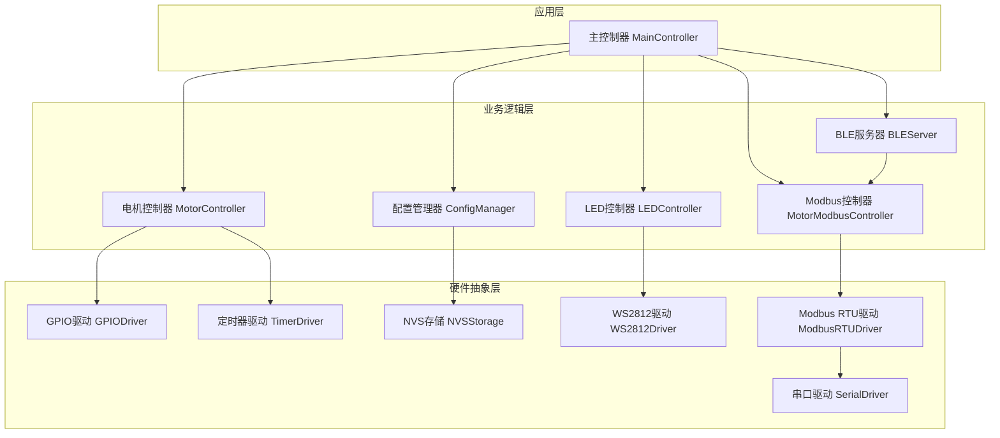
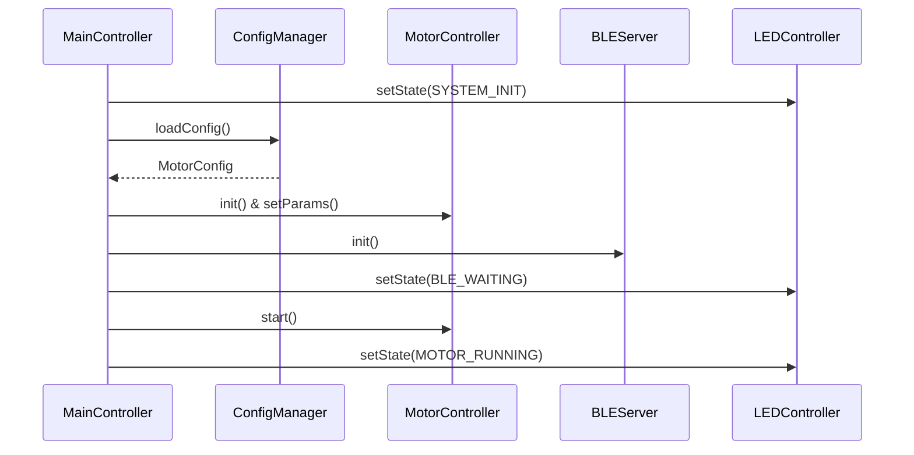
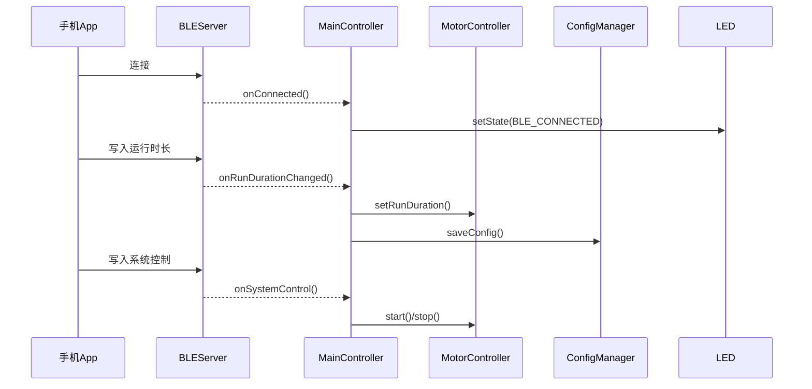
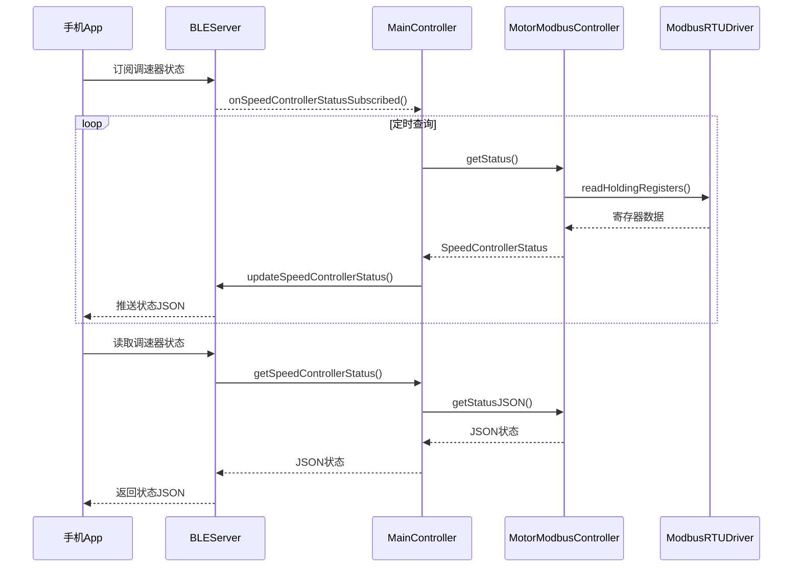

# ESP32-S3-Zero 电机定时控制系统架构设计

## 1. 架构概述

本系统是一个基于ESP32-S3-Zero的简单电机定时控制系统，通过BLE无线控制电机的运行时长和停止间隔，实现自动循环控制。

### 1.1 设计原则
- **简单性**: 避免过度设计，保持代码结构清晰
- **模块化**: 功能模块独立，便于维护和测试
- **实时性**: 确保电机控制的实时响应
- **可靠性**: 参数持久化存储，系统状态可恢复

## 2. 系统架构

### 2.1 整体架构图



### 2.2 核心模块划分

| 模块名称 | 职责 | 依赖关系 |
|---------|------|----------|
| MainController | 系统主控制器，协调各模块工作 | 依赖所有业务模块 |
| MotorController | 电机控制逻辑，定时循环控制 | GPIODriver, TimerDriver |
| BLEServer | BLE通信服务，处理手机连接和数据交换 | MotorModbusController |
| LEDController | LED状态指示控制 | WS2812Driver |
| ConfigManager | 配置参数管理和持久化 | NVSStorage |
| MotorModbusController | 调速器Modbus通信控制 | ModbusRTUDriver |

## 3. 模块接口设计

### 3.1 MotorController 接口

```cpp
class MotorController {
public:
    // 初始化电机控制器
    bool init(uint8_t motor_pin);
    
    // 设置运行参数
    void setRunDuration(uint32_t duration_seconds);
    void setStopInterval(uint32_t interval_seconds);
    
    // 控制命令
    void start();
    void stop();
    
    // 状态查询
    bool isRunning() const;
    uint32_t getRemainingRunTime() const;
    uint32_t getRemainingStopTime() const;
    uint32_t getCurrentCycleCount() const;
    MotorControllerState getCurrentState() const;
    
    // 定时器回调处理
    void onTimer();
    
private:
    enum MotorControllerState { STOPPED, RUNNING, STOPPING, STARTING, ERROR };
    MotorControllerState current_state;
    uint32_t run_duration;
    uint32_t stop_interval;
    uint32_t remaining_run_time;
    uint32_t remaining_stop_time;
    uint32_t current_cycle_count;
};
```

### 3.2 BLEServer 接口

```cpp
class BLEServer {
public:
    // 初始化BLE服务
    bool init(const char* device_name);
    
    // 设置特征值回调
    void setRunDurationCallback(std::function<void(uint32_t)> callback);
    void setStopIntervalCallback(std::function<void(uint32_t)> callback);
    void setSystemControlCallback(std::function<void(uint8_t)> callback);
    
    // 状态推送
    void updateStatus(const String& json_status);
    void updateSpeedControllerStatus(const String& json_status);
    
    // 连接状态
    bool isConnected() const;
    
private:
    BLEService* motor_service;
    BLECharacteristic* run_duration_char;
    BLECharacteristic* stop_interval_char;
    BLECharacteristic* system_control_char;
    BLECharacteristic* status_char;
    BLECharacteristic* speed_controller_status_char;
};
```

### 3.2.1 BLE特征服务数据格式

| 特征名称 | UUID | 权限 | 数据格式 | 范围/示例 |
|---------|------|------|----------|-----------|
| 运行时长 | `2f7a9c2e-6b1a-4b5e-8b2a-c1c2c3c4c5c6` | 读/写/通知 | 字符串格式的秒数 | "1" - "999" |
| 停止间隔 | `3f8a9c2e-6b1a-4b5e-8b2a-c1c2c3c4c5c7` | 读/写/通知 | 字符串格式的秒数 | "0" - "999" |
| 系统控制 | `4f9a9c2e-6b1a-4b5e-8b2a-c1c2c3c4c5c8` | 读/写/通知 | 字符串格式的控制命令 | "0"=停止, "1"=启动 |
| 状态查询 | `5f9a9c2e-6b1a-4b5e-8b2a-c1c2c3c4c5c9` | 读/通知 | JSON格式状态信息 | 见状态查询示例 |
| 调速器状态 | `6f9a9c2e-6b1a-4b5e-8b2a-c1c2c3c4c5ca` | 读/通知 | JSON格式调速器状态 | 见调速器状态示例 |
| 调速器状态设定 | `7f9a9c2e-6b1a-4b5e-8b2a-c1c2c3c4c5cb` | 读/写/通知 | JSON格式调速器配置 | 见调速器配置示例 |

#### 状态查询JSON格式
```json
{
  "state": 1,
  "stateName": "RUNNING",
  "remainingRunTime": 25,
  "remainingStopTime": 0,
  "currentCycleCount": 3,
  "runDuration": 30,
  "stopDuration": 10,
  "cycleCount": 5,
  "autoStart": true,
  "uptime": 123456,
  "freeHeap": 234567,
  "chipTemperature": 32.5
}
```

#### 调速器状态JSON格式
```json
{
  "moduleAddress": 1,
  "isRunning": true,
  "frequency": 1000,
  "dutyCycle": 75,
  "externalSwitch": false,
  "analogControl": false,
  "powerOnState": false,
  "minOutput": 10,
  "maxOutput": 90,
  "softStartTime": 50,
  "softStopTime": 30,
  "communication": {
    "lastUpdateTime": 1642678800000,
    "connectionStatus": "connected",
    "errorCount": 0,
    "responseTime": 15
  }
}
```
### 3.3 MotorModbusController 接口

```cpp
struct SpeedControllerStatus {
    uint8_t moduleAddress;        // 模块地址 (1-255)
    bool isRunning;               // 运行状态
    uint32_t frequency;           // 当前频率 (Hz)
    uint8_t dutyCycle;            // 当前占空比 (0-100%)
    
    // 配置参数
    bool externalSwitch;          // 外接开关功能
    bool analogControl;           // 0-10V控制功能
    bool powerOnState;            // 开机默认状态
    uint8_t minOutput;            // 最小输出百分比
    uint8_t maxOutput;            // 最大输出百分比
    uint16_t softStartTime;       // 缓启动时间 (0.1s单位)
    uint16_t softStopTime;        // 缓停止时间 (0.1s单位)
    
    struct {
        uint64_t lastUpdateTime;  // 最后更新时间戳
        String connectionStatus;  // 连接状态
        uint32_t errorCount;      // 通信错误计数
        uint16_t responseTime;    // 响应时间 (ms)
    } communication;
};

class MotorModbusController {
public:
    // 初始化Modbus控制器
    bool init(uint8_t rx_pin, uint8_t tx_pin, uint8_t module_address = 1);
    
    // 控制命令
    bool startOutput();
    bool stopOutput();
    bool setFrequency(uint32_t frequency);
    bool setDutyCycle(uint8_t duty_cycle);
    
    // 配置管理
    bool setExternalSwitch(bool enabled);
    bool setAnalogControl(bool enabled);
    bool setPowerOnState(bool enabled);
    bool setOutputRange(uint8_t min_output, uint8_t max_output);
    bool setSoftTiming(uint16_t start_time, uint16_t stop_time);
    
    // 状态查询
    bool getStatus(SpeedControllerStatus& status);
    bool isConnected() const;
    
    // JSON格式状态
    String getStatusJSON();
    
private:
    ModbusRTUDriver* modbus_driver;
    uint8_t module_address;
    SpeedControllerStatus last_status;
    uint64_t last_update_time;
    uint32_t error_count;
};
```

### 3.4 LEDController 接口

```cpp
class LEDController {
public:
    enum LEDState {
        SYSTEM_INIT,      // 白色闪烁
        BLE_WAITING,      // 蓝色慢闪
        BLE_CONNECTED,    // 绿色常亮
        MOTOR_RUNNING,    // 青色常亮
        MOTOR_STOPPED,    // 黄色常亮
        SYSTEM_STOPPED    // 红色常亮
    };
    
    // 初始化LED控制器
    bool init(uint8_t led_pin);
    
    // 设置LED状态
    void setState(LEDState state);
    
    // 定时器回调处理闪烁效果
    void onTimer();
    
private:
    LEDState current_state;
    bool blink_state;
};
```

### 3.5 ConfigManager 接口

```cpp
struct MotorConfig {
    uint32_t run_duration;    // 运行时长(秒)
    uint32_t stop_interval;   // 停止间隔(秒)
    bool auto_start;          // 开机自动启动
    uint32_t cycle_count;     // 循环次数
};

class ConfigManager {
public:
    // 初始化配置管理器
    bool init();
    
    // 加载配置
    MotorConfig loadConfig();
    
    // 保存配置
    bool saveConfig(const MotorConfig& config);
    
    // 获取默认配置
    static MotorConfig getDefaultConfig();
    
private:
    static const char* NVS_NAMESPACE;
    static const char* CONFIG_KEY;
};
```

## 4. 数据流设计

### 4.1 系统启动流程



### 4.2 BLE控制流程



### 4.3 调速器状态查询流程



## 5. 关键技术决策

### 5.1 定时器策略
- 使用ESP32硬件定时器，精度1ms
- 主定时器负责电机状态切换和倒计时
- LED闪烁使用独立的软件计数器

### 5.2 Modbus通信策略
- 使用ESP32硬件串口UART1进行Modbus RTU通信
- 波特率9600，8N1数据格式，符合调速器规格
- 实现读保持寄存器(0x03)、写单个寄存器(0x06)、写多个寄存器(0x10)功能码
- 定时轮询调速器状态，避免频繁查询影响性能

### 5.3 状态管理
- 电机控制器维护独立的状态机
- LED状态与系统状态解耦，便于扩展
- BLE连接状态独立管理

### 5.4 数据存储
- 使用NVS存储用户配置参数
- 配置变更立即持久化
- 系统重启后自动恢复上次配置

### 5.5 错误处理
- 各模块初始化失败时返回错误码
- BLE断连时系统继续正常工作
- 参数越界时使用默认值并记录日志

## 6. 文件组织结构

```
src/
├── main.cpp                 // 主程序入口
├── controllers/
│   ├── MainController.h/.cpp        // 主控制器
│   ├── MotorController.h/.cpp       // 电机控制器
│   ├── MotorBLEServer.h/.cpp        // BLE服务器
│   ├── LEDController.h/.cpp         // LED控制器
│   ├── ConfigManager.h/.cpp         // 配置管理器
│   └── MotorModbusController.h/.cpp // Modbus控制器
├── drivers/
│   ├── GPIODriver.h/.cpp            // GPIO驱动
│   ├── TimerDriver.h/.cpp           // 定时器驱动
│   ├── NVSStorageDriver.h/.cpp      // NVS存储驱动
│   ├── WS2812Driver.h/.cpp          // WS2812驱动
│   ├── ModbusRTUDriver.h/.cpp       // Modbus RTU驱动
│   └── SerialDriver.h/.cpp          // 串口驱动
└── common/
    ├── Config.h                     // 全局配置定义
    ├── Logger.h/.cpp                // 日志工具
    ├── StateManager.h/.cpp          // 状态管理器
    ├── EventManager.h/.cpp          // 事件管理器
    └── PowerManager.h/.cpp          // 电源管理器
```

## 7. 开发和测试建议

### 7.1 开发顺序
1. 实现硬件驱动层（GPIO、定时器、NVS、WS2812）
2. 实现配置管理器和LED控制器
3. 实现电机控制器核心逻辑
4. 实现BLE服务器
5. 集成主控制器
6. 系统测试和优化

### 7.2 测试策略
- 单元测试：各模块独立功能测试
- 集成测试：模块间接口测试
- 硬件测试：实际硬件环境验证
- 压力测试：长时间运行稳定性测试

---

**文档版本**: v1.0  
**创建日期**: 2025-01-28  
**负责人**: 架构师