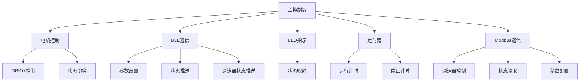
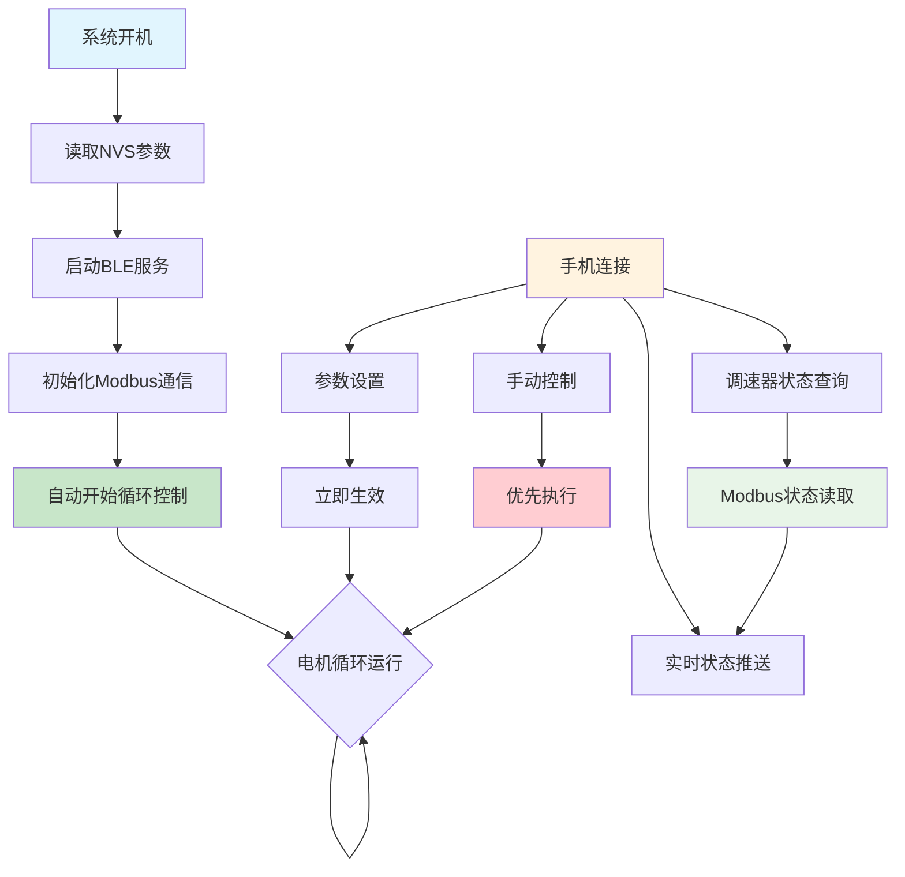

# ESP32-S3-Zero 电机定时控制系统需求规格书

## 1. 项目概述

### 1.1 项目目标
开发一个简单的电机定时控制系统，通过BLE无线控制电机的运行时长和停止间隔，实现自动循环控制。

### 1.2 硬件平台
- **主控制器**: ESP32-S3-Zero开发板
- **电机控制**: SMG 30A电机调速器（通过GPIO控制开关）
- **状态指示**: 板载WS2812 RGB LED (GPIO 21)
- **开发环境**: PlatformIO + VSCode
- **开发语言**: C/C++

## 2. 核心功能

### 2.1 电机控制逻辑
- **控制引脚**: GPIO 7
- **控制逻辑**: 默认高电平，低电平启动电机
- **工作模式**: 运行X时长 → 停止Y秒 → 运行X时长（连续循环）
- **参数范围**:
  - 运行时长: 1-999秒
  - 停止间隔: 1-999秒

### 2.2 BLE控制接口
- **设备名称**: "ESP32-Motor-Control"
- **服务UUID**: `beb5483e-36e1-4688-b7f5-ea07361b26a8`

**BLE特征值定义**:

| 特征名称 | UUID | 权限 | 数据格式 | 范围/示例 |
|---------|------|------|----------|-----------|
| 运行时长 | `2f7a9c2e-6b1a-4b5e-8b2a-c1c2c3c4c5c6` | 读/写/通知 | 字符串格式的秒数 | "1" - "999" |
| 停止间隔 | `3f8a9c2e-6b1a-4b5e-8b2a-c1c2c3c4c5c7` | 读/写/通知 | 字符串格式的秒数 | "0" - "999" |
| 系统控制 | `4f9a9c2e-6b1a-4b5e-8b2a-c1c2c3c4c5c8` | 读/写/通知 | 字符串格式的控制命令 | "0"=停止, "1"=启动 |
| 状态查询 | `5f9a9c2e-6b1a-4b5e-8b2a-c1c2c3c4c5c9` | 读/通知 | JSON格式状态信息 | 见状态信息示例 |
| 调速器状态 | `6f9a9c2e-6b1a-4b5e-8b2a-c1c2c3c4c5ca` | 读/通知 | JSON格式调速器状态 | 见调速器状态示例 |
| 调速器状态设定 | `7f9a9c2e-6b1a-4b5e-8b2a-c1c2c3c4c5cb` | 读/写/通知 | JSON格式调速器配置 | 见调速器配置示例 |

### 2.3 状态信息
```json
{
  "state": 1,                   // 电机状态码: 0=STOPPED, 1=RUNNING, 2=STOPPING, 3=STARTING, 4=ERROR
  "stateName": "RUNNING",       // 电机状态名称
  "runDuration": 30,            // 运行时长设置(秒)
  "stopDuration": 60,           // 停止间隔设置(秒)
  "remainingRunTime": 25,       // 剩余运行时间(秒)
  "remainingStopTime": 0,       // 剩余停止时间(秒)
  "currentCycleCount": 15,      // 当前循环次数
  "cycleCount": 100,            // 目标循环次数(0=无限循环)
  "autoStart": true,            // 是否自动启动
  "uptime": 3600,               // 系统运行时间(毫秒)
  "freeHeap": 123456,           // 可用内存(字节)
  "chipTemperature": 32.5       // 芯片温度(摄氏度)
}
```

**状态变更事件推送格式**（仅在系统状态变更时推送）：
```json
{
  "state": 1,
  "stateName": "RUNNING",
  "runDuration": 30,
  "stopDuration": 60,
  "remainingRunTime": 25,
  "remainingStopTime": 0,
  "currentCycleCount": 15,
  "cycleCount": 100,
  "autoStart": true,
  "uptime": 3600,
  "freeHeap": 123456,
  "chipTemperature": 32.5,
  "systemState": "RUNNING",
  "systemStateReason": "User command",
  "eventType": "system_state_change",
  "eventTime": 3600,
  "stateChange": {
    "from": "IDLE",
    "to": "RUNNING",
    "reason": "User command"
  }
}
```

### 2.4 调速器状态信息
基于 Modbus RTU 协议的调速器状态信息，包含实时运行参数和配置信息：

```json
{
  "moduleAddress": 1,           // 模块地址 (1-255)
  "isRunning": true,            // 运行状态: true=运行中, false=停止
  "frequency": 1000,            // 当前频率 (Hz)
  "dutyCycle": 75,              // 当前占空比 (0-100%)
  "externalSwitch": false,      // 外接开关功能: true=开启, false=关闭
  "analogControl": false,       // 0-10V控制功能: true=开启, false=关闭
  "powerOnState": false,        // 开机默认状态: true=运行, false=停止
  "minOutput": 10,              // 最小输出百分比 (0-50%)
  "maxOutput": 90,              // 最大输出百分比 (60-100%)
  "softStartTime": 50,          // 缓启动时间 (0.1秒单位, 50=5秒)
  "softStopTime": 30,           // 缓停止时间 (0.1秒单位, 30=3秒)
  "communication": {
    "lastUpdateTime": 1642678800000,  // 最后更新时间戳 (毫秒)
    "connectionStatus": "connected",   // 连接状态: "connected", "disconnected", "error"
    "errorCount": 0,                   // 通信错误计数
    "responseTime": 15                 // 最后响应时间 (毫秒)
  }
}
```json
{
  "moduleAddress": 1,
  "isRunning": true,
  "frequency": 1500,
  "dutyCycle": 80,
  "externalSwitch": false,
  "analogControl": false,
  "powerOnState": false,
  "minOutput": 10,
  "maxOutput": 90,
  "softStartTime": 50,
  "softStopTime": 30,
  "communication": {
    "lastUpdateTime": 1642678800000,
    "connectionStatus": "connected",
    "errorCount": 0,
    "responseTime": 12
  },
  "eventType": "speed_controller_state_change",
  "eventTime": 1642678800000,
  "stateChange": {
    "field": "frequency",
    "from": 1000,
    "to": 1500,
    "reason": "User command via Modbus"
  }
}
```
### 2.5 LED状态指示
| 状态 | 颜色 | 模式 | 说明 |
|------|------|------|------|
| 系统启动 | 白色 | 闪烁 | 初始化中 |
| BLE等待连接 | 蓝色 | 慢闪 | 等待手机连接 |
| BLE已连接 | 绿色 | 常亮 | 手机已连接 |
| 电机运行 | 青色 | 常亮 | 电机正在运行 |
| 电机停止 | 黄色 | 常亮 | 电机停止中 |
| 系统停止 | 红色 | 常亮 | 手动停止状态 |

## 3. 技术规格

### 3.1 GPIO分配
```
GPIO 21  - WS2812 RGB LED (板载)
GPIO 7   - 电机控制信号输出
GPIO 8   - Modbus RTU RX (调速器通信)
GPIO 9   - Modbus RTU TX (调速器通信)
```

### 3.2 系统架构


### 3.3 系统工作逻辑


### 3.4 数据存储
使用NVS存储用户设置的参数：
```cpp
struct MotorConfig {
    uint32_t run_duration;    // 运行时长(秒)
    uint32_t stop_interval;   // 停止间隔(秒)
    bool auto_start;          // 开机自动启动
};
```

## 4. 工作流程

### 4.1 系统启动流程
1. 系统初始化，LED白色闪烁
2. 从NVS读取保存的参数
3. 启动BLE服务，LED蓝色慢闪
4. 自动开始电机循环控制（无需等待手机连接）

### 4.2 运行控制流程
1. 系统开机后自动开始循环控制
2. 循环模式：运行X时长(LED青色) → 停止Y秒(LED黄色)，如果停止间隔为0则持续运行
3. 手机连接后，LED绿色常亮，可实时查看状态
4. 手机可随时发送启动/停止命令改变运行状态
5. 实时推送状态和倒计时给手机（如果已连接）

### 4.3 参数设置流程
1. 手机通过BLE写入运行时长和停止间隔
2. 系统保存参数到NVS
3. 新参数立即生效，当前循环会根据新参数调整

### 4.4 手动控制流程
1. 手机连接后可随时发送系统控制命令
2. 启动命令(1)：立即开始或重新开始循环
3. 停止命令(0)：立即停止电机并暂停循环
4. 控制命令优先级高于自动循环逻辑

## 5. 测试要求

### 5.1 测试环境
项目支持多种测试环境：

1. **单元测试环境** (`test`): 运行所有单元测试
2. **MODBUS测试环境** (`modbus-test`): 专门用于MODBUS通信测试
3. **串口交互测试环境** (`test-runner`): 通过串口命令行交互进行测试

### 5.2 串口交互测试功能
串口交互测试环境提供以下功能：

- **命令行界面**: 通过串口发送命令执行特定测试
- **实时反馈**: 测试结果实时输出到串口
- **模块化测试**: 可单独测试各个功能模块
- **循环演示**: 部分模块支持持续运行演示

**支持的测试命令**:
```
0. 运行所有测试
1. GPIO驱动测试
2. 定时器驱动测试
3. WS2812驱动测试
4. NVS存储驱动测试
5. LED控制器测试
6. ConfigManager测试
7. MotorController测试
8. BLE服务器测试
9. EventManager测试
a. StateManager测试
b. 电机循环控制测试
c. BLE交互流程测试
d. 错误处理测试
h. 显示帮助信息
```

### 5.3 测试执行方式
```bash
# 编译并上传测试固件
pio run -e test-runner --target upload

# 打开串口监视器
pio device monitor

# 在串口监视器中输入命令执行测试
# 例如输入 '7' 执行MotorController测试
```

---

**文档版本**: v2.0  
**创建日期**: 2025-01-28  
**最后更新**: 2025-01-28  
**负责人**: 开发团队