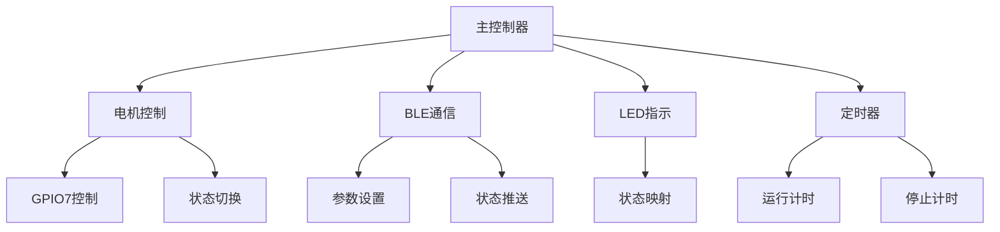
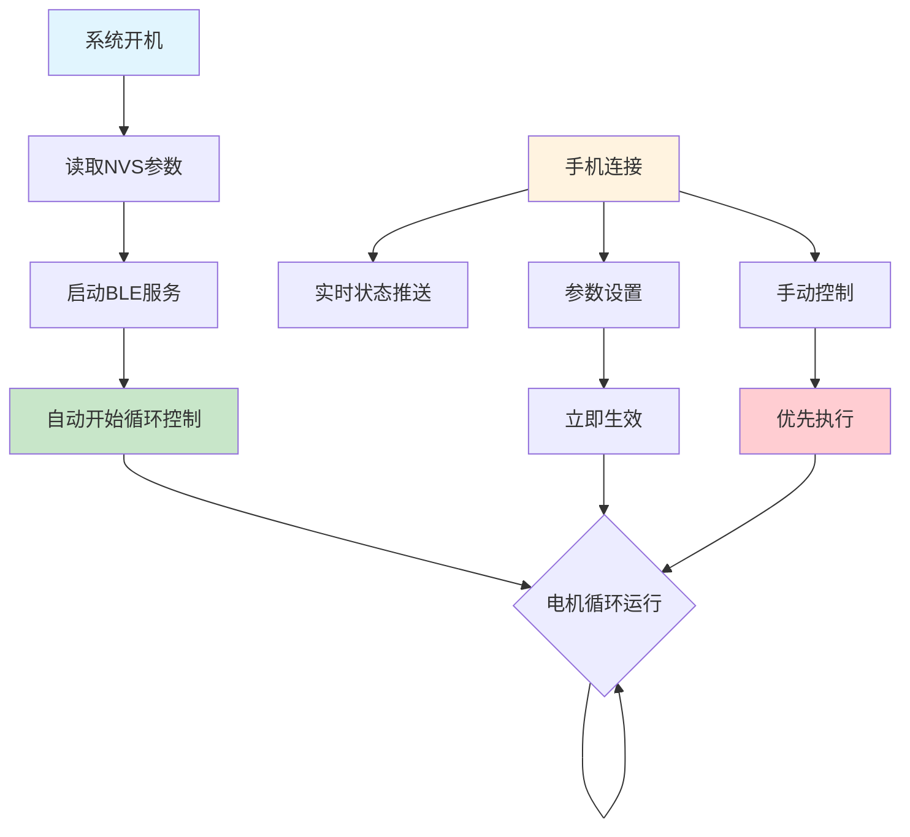

# ESP32-S3-Zero 电机定时控制系统需求规格书

## 1. 项目概述

### 1.1 项目目标
开发一个简单的电机定时控制系统，通过BLE无线控制电机的运行时长和停止间隔，实现自动循环控制。

### 1.2 硬件平台
- **主控制器**: ESP32-S3-Zero开发板
- **电机控制**: SMG 30A电机调速器（通过GPIO控制开关）
- **状态指示**: 板载WS2812 RGB LED (GPIO 21)
- **开发环境**: PlatformIO + VSCode
- **开发语言**: C/C++

## 2. 核心功能

### 2.1 电机控制逻辑
- **控制引脚**: GPIO 7
- **控制逻辑**: 默认高电平，低电平启动电机
- **工作模式**: 运行X时长 → 停止Y秒 → 运行X时长（连续循环）
- **参数范围**:
  - 运行时长: 1-999秒
  - 停止间隔: 1-999秒

### 2.2 BLE控制接口
- **设备名称**: "ESP32-Motor-Control"
- **服务UUID**: `beb5483e-36e1-4688-b7f5-ea07361b26a8`

**BLE特征值定义**:
| 功能 | UUID | 数据类型 | 读写权限 | 说明 |
|------|------|----------|----------|------|
| 运行时长 | `2f7a9c2e-6b1a-4b5e-8b2a-c1c2c3c4c5c6` | 字符串格式的秒数 | R/W | 1-999秒，小端格式 |
| 停止间隔 | `3f8a9c2e-6b1a-4b5e-8b2a-c1c2c3c4c5c7` | 字符串格式的秒数 | R/W | 0-999秒，小端格式 |
| 系统控制 | `4f9a9c2e-6b1a-4b5e-8b2a-c1c2c3c4c5c8` | 字符串格式的秒数 | R/W | 0=停止, 1=启动 |
| 状态查询 | `5f9a9c2e-6b1a-4b5e-8b2a-c1c2c3c4c5c9` | JSON | R | 系统状态信息 |

### 2.3 状态信息
```json
{
  "state": 1,                   // 电机状态码: 0=STOPPED, 1=RUNNING, 2=STOPPING, 3=STARTING, 4=ERROR
  "stateName": "RUNNING",       // 电机状态名称
  "runDuration": 30,            // 运行时长设置(秒)
  "stopDuration": 60,           // 停止间隔设置(秒)
  "remainingRunTime": 25,       // 剩余运行时间(秒)
  "remainingStopTime": 0,       // 剩余停止时间(秒)
  "currentCycleCount": 15,      // 当前循环次数
  "cycleCount": 100,            // 目标循环次数(0=无限循环)
  "autoStart": true,            // 是否自动启动
  "uptime": 3600,               // 系统运行时间(毫秒)
  "freeHeap": 123456,           // 可用内存(字节)
  "chipTemperature": 32.5       // 芯片温度(摄氏度)
}
```

**状态变更事件推送格式**（仅在系统状态变更时推送）：
```json
{
  "state": 1,
  "stateName": "RUNNING",
  "runDuration": 30,
  "stopDuration": 60,
  "remainingRunTime": 25,
  "remainingStopTime": 0,
  "currentCycleCount": 15,
  "cycleCount": 100,
  "autoStart": true,
  "uptime": 3600,
  "freeHeap": 123456,
  "chipTemperature": 32.5,
  "systemState": "RUNNING",
  "systemStateReason": "User command",
  "eventType": "system_state_change",
  "eventTime": 3600,
  "stateChange": {
    "from": "IDLE",
    "to": "RUNNING",
    "reason": "User command"
  }
}
```

### 2.4 LED状态指示
| 状态 | 颜色 | 模式 | 说明 |
|------|------|------|------|
| 系统启动 | 白色 | 闪烁 | 初始化中 |
| BLE等待连接 | 蓝色 | 慢闪 | 等待手机连接 |
| BLE已连接 | 绿色 | 常亮 | 手机已连接 |
| 电机运行 | 青色 | 常亮 | 电机正在运行 |
| 电机停止 | 黄色 | 常亮 | 电机停止中 |
| 系统停止 | 红色 | 常亮 | 手动停止状态 |

## 3. 技术规格

### 3.1 GPIO分配
```
GPIO 21  - WS2812 RGB LED (板载)
GPIO 7   - 电机控制信号输出
```

### 3.2 系统架构


### 3.3 系统工作逻辑


### 3.4 数据存储
使用NVS存储用户设置的参数：
```cpp
struct MotorConfig {
    uint32_t run_duration;    // 运行时长(秒)
    uint32_t stop_interval;   // 停止间隔(秒)
    bool auto_start;          // 开机自动启动
};
```

## 4. 工作流程

### 4.1 系统启动流程
1. 系统初始化，LED白色闪烁
2. 从NVS读取保存的参数
3. 启动BLE服务，LED蓝色慢闪
4. 自动开始电机循环控制（无需等待手机连接）

### 4.2 运行控制流程
1. 系统开机后自动开始循环控制
2. 循环模式：运行X时长(LED青色) → 停止Y秒(LED黄色)，如果停止间隔为0则持续运行
3. 手机连接后，LED绿色常亮，可实时查看状态
4. 手机可随时发送启动/停止命令改变运行状态
5. 实时推送状态和倒计时给手机（如果已连接）

### 4.3 参数设置流程
1. 手机通过BLE写入运行时长和停止间隔
2. 系统保存参数到NVS
3. 新参数立即生效，当前循环会根据新参数调整

### 4.4 手动控制流程
1. 手机连接后可随时发送系统控制命令
2. 启动命令(1)：立即开始或重新开始循环
3. 停止命令(0)：立即停止电机并暂停循环
4. 控制命令优先级高于自动循环逻辑

---

**文档版本**: v2.0  
**创建日期**: 2025-01-28  
**最后更新**: 2025-01-28  
**负责人**: 开发团队